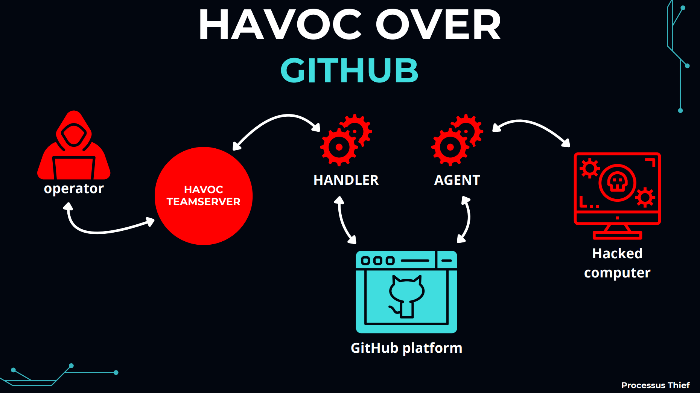

<p align="center">
  
</p>

# HavocHub

**PoC of a Havoc agent communicating over GitHub**

This project demonstrates a Proof-of-Concept (PoC) for a Red Team post-exploitation agent and handler that uses **GitHub Issues and Comments** as its Command and Control (C2) channel. All command and data exchanges are obfuscated in base64 and masquerade as normal developer activity, enabling stealthy operations while blending in with legitimate GitHub traffic.

---

## How It Works

- The Python agent, executed on the target machine, creates a GitHub issue and posts base64-encoded comments.
- The handler (running server-side) fetches the latest issue and exchanges commands/results through comments, acting as a relay to Havoc’s API.
- Communication flows entirely through the GitHub API, providing a covert and resilient C2 channel.
- The Havoc operator can issue commands as usual; results are transferred back and forth via GitHub.

<p align="center">
  
</p>

---

## How To Use

### 1. Create a GitHub Account

Sign up for a GitHub account at [https://github.com/](https://github.com/).

### 2. Access Your GitHub Tokens

Navigate to [https://github.com/settings/tokens](https://github.com/settings/tokens).

### 3. Create a Classic Personal Access Token

- Click “Generate new token (classic)”.
- Give it a descriptive name and set **repo** access permissions.
- Copy the token and update these values in both `agent.py` and `handler.py`:

```python
# --- CONFIG ---
GITHUB_TOKEN = "ghp_XXXXXXXXXXXXXXXXXXXXXXXXXXXXX" 
REPO_OWNER = "YOUR_USERNAME"
REPO_NAME = "your_repository"
ISSUE_LABEL = "HAVOCHUB"
```

### 4. Configure Havoc API Service and External Endpoint

Update your Havoc profile (e.g., havoc.yaotl) as follows:

```yaotl
Listeners {
    Http {
        Name         = "http"
        Hosts        = ["YOUR PUBLIC IP ADDRESS"]
        HostBind     = "0.0.0.0"
        HostRotation = "round-robin"
        PortBind     = 80
        PortConn     = 80
        Secure       = false
        UserAgent    = "Mozilla/5.0 (Windows NT 6.1; WOW64) AppleWebKit/537.36 (KHTML, like Gecko) Chrome/96.0.4664.110 Safari/537.36"
    }
    External {
        Name            = "your_external_c2_endpoint"
        Endpoint        = "your_external_c2_endpoint"
    }
}
Service {
    Endpoint = "YOUR_SERVICE_ENDPOINT"
    Password = "YOUR_SERVICE_PASSWORD"
}
```

### 5. Update the Handler Configuration

Set the API and endpoints accordingly in your handler.py:

```yaotl
HAVOC_SERVICE_ENDPOINT = "wss://127.0.0.1:443/YOUR_SERVICE_ENDPOINT"
HAVOC_SERVICE_PASSWORD = "YOUR_SERVICE_PASSWORD"
EXTERNAL_C2_ENDPOINT = "http://127.0.0.1/your_external_c2_endpoint"
```

---

## Social Networks

**Christopher Thiefin (Processus)**  
Trainer & Speaker in Cybersecurity 💻🎥 | Microsoft Security MVP

- [YouTube](https://www.youtube.com/c/processusthief)
- [Twitter](https://x.com/ProcessusT)
- [LinkedIn](https://www.linkedin.com/in/christopher-thiefin/)

---

## Video Demo

[Watch the Demo](assets/demo.mp4)

---

## Limits

This project relies on communication through the GitHub API, which enforces several rate limits.  
- Exceeding these limits may result in delayed agent communication or API errors.
- For detailed explanations, refer to the [GitHub REST API Rate Limits documentation](https://docs.github.com/fr/rest/using-the-rest-api/rate-limits-for-the-rest-api?apiVersion=2022-11-28#about-secondary-rate-limits).

**Note:** The agent and handler are designed for research, educational usage, and laboratory environments.  
Do not use this project for unlawful activities or abuse public infrastructure.

---

## TODO

- Update `lastCallback`:  
  Add a function in `havoc/agent.py` to update `AgentInfo.LastCallIn` with every communication or callback.

Feel free to contribute with pull requests or suggestions!
